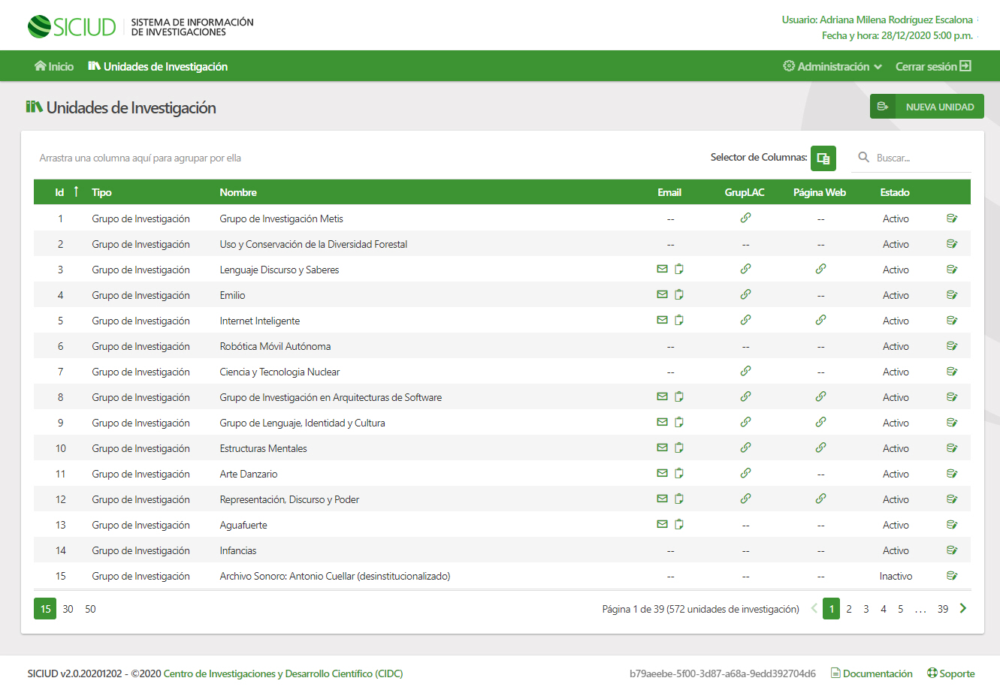

# siciud_cliente

Cliente para el Sistema de Información del Centro de Investigaciones y Desarrollo Científico (SICIUD v2.0)



## Especificaciones Técnicas

### Tecnologías Implementadas y Versiones

- <a href="https://vuejs.org/" target="_blank">Vue.js 2.0</a>
- <a href="https://nodejs.org/es/download/releases/" target="_blank">Node.js 13.14.0</a>
- <a href="https://jquery.com/" target="_blank">jQuery 3.5.1</a>
- <a href="https://getbootstrap.com/docs/4.5/getting-started/introduction/" target="_blank">Bootstrap 4.0</a>

### Variables de Entorno

Las siguientes son las variables de entorno definidas para el proyecto:

```shell
VUE_APP_API_URL=[Url de la API 'siciud_crud' (terminada en '/api/v1')]
VUE_APP_AUTH_URL=[Url de la autorización local]
VUE_APP_AUTORIZATION_URL=[URL de autorización OAS OAuth 2]
VUE_APP_BASE_URL=[Url base del proyecto]
VUE_APP_CLIENTE_ID=[ID de cliente de autorización OAS OAuth 2]
VUE_APP_REDIRECT_URL=[Url de redirección pos autorización OAS OAuth 2]
VUE_APP_RESPONSE_TYPE=[Tipo de respuesta de la autorización OAS OAuth 2]
VUE_APP_SCOPE=['Scope' de la autorización OAS OAuth 2]
VUE_APP_SIGN_OUT_APPEND_TOKEN=[Establece si adiciona el token a la respuesta de la autorización OAS OAuth 2 (true)]
VUE_APP_SIGN_OUT_REDIRECT_URL=[Url de redirección pos salida OAS OAuth 2]
VUE_APP_SIGN_OUT_URL=[Url de petición para salida OAS OAuth 2]
VUE_APP_URL_USER_INFO=[Url de obtencion de información de usuario OAS OAuth 2]
```

### Ejecución del Proyecto

Los siguientes son los pasos para ejecutar el proyecto en un entorno local:

```bash
# Clonar repositorio GIT en el directorio 'siciud_cliente'
git clone https://github.com/udistrital/siciud_cliente.git siciud_cliente
# Ingresar al directorio
cd siciud_cliente
# Restaurar dependencias
npm install
# Ejecutar (Por defecto puerto 4500 en 'localhost')
npm run serve
```

Para cambiar el puerto y/o el host por defecto se debe editar el archivo _**'package.json'**_ con los datos deseados:

> _"serve": "vue-cli-service serve **--port 4500 --host localhost** --https false"_

### Ejecución Dockerfile

Para construir la imagen y compilar la versión de producción:

```bash
docker build -t cidc.udistrital.edu.co/siciud:v2.0 .
```

Para ejecutar **por primera vez** la imagen en el contenedor 'siciud-v2-front' exponiendo el puerto '8080':

```bash
docker run -it -p 8080:80 -d --name siciud-v2-front cidc.udistrital.edu.co/siciud:v2.0
```

Para las ejecuciones posteriores del contenedor 'siciud-v2-front' previamente creado:

```bash
docker start siciud-v2-front
```

Para detener el contenedor 'siciud-v2-front' creado:

```bash
docker stop siciud-v2-front
```

### Ejecución docker-compose

```bash
# Does not apply
```

### Ejecución Pruebas

```bash
# Does not apply
```

### Ejecución CI

| Develop                                                                                                                                                                                                        | Release 0.0.2                                                                                                                                                                     | Master |
| -------------------------------------------------------------------------------------------------------------------------------------------------------------------------------------------------------------- | --------------------------------------------------------------------------------------------------------------------------------------------------------------------------------- | ------ |
| [](https://hubci.portaloas.udistrital.edu.co/udistrital/siciud_cliente) | [](https://hubci.portaloas.udistrital.edu.co/udistrital/siciud_cliente) |

### Licencia

This file is part of siciud_cliente.

siciud_cliente is free software: you can redistribute it and/or modify it under the terms of the GNU General Public License as published by the Free Software Foundation, either version 3 of the License, or (at your option) any later version.

siciud_cliente is distributed in the hope that it will be useful, but WITHOUT ANY WARRANTY; without even the implied warranty of MERCHANTABILITY or FITNESS FOR A PARTICULAR PURPOSE. See the GNU General Public License for more details.

You should have received a copy of the GNU General Public License along with siciud_cliente. If not, see https://www.gnu.org/licenses/.
